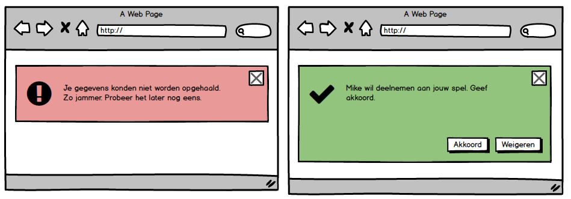

**Taakgroep: Javascript Basics**

# Context

In deze periode ontwikkel je een multiplayer game. Het client gedeelte bestaat uit een client side applicatie, dus een applicatie die in de browser aanwezig is en communiceert via HTTP met de server. Daarvoor heb je een aantal technieken in de client nodig: `html`, `css` en `javascript`. In dit level leer je eerst de basics van Javascript. Er wordt van je verwacht dat je controles `if then else` en herhalingen `for`/`while` in staat bent om zelf te onderzoeken en je eigen te maken.

# Taak: Feedback aan de gebruiker tonen

Met deze opdracht maak je de basis voor een widget die je in de komende tijd steeds verder zult uitbreiden. Het doel van de widget is om aan de gebruiker feedback te geven. Door middel van de widget kun je het gedrag van de gebruiker bekrachtigen, of als er een fout optreedt een waarschuwing geven. Na het uitvoeren van deze taak kun je vanuit de `console` van de browser een feedback widget aan de gebruiker tonen en verbergen.



## Aanpak

Aan de gegeven `html` voeg je `javascript` toe zodat delen van deze html dynamisch getoond en verborgen kunnen worden.

-   Maak een project aan in Webstorm.

-   Op de ELO staat een [lab javascript\_getting\_started](#lab-javascript_getting_started). Kopieer de inhoud van de map in root van het project.

-   Voeg de volgende [`javascript` function](#javascript-function) toe aan de `index.html` in het `body` element:


```javascript
<script>
function toggleFeedback(elementId) {
  var x = document.getElementById(elementId);
  if (x.style.display === "none") {
    x.style.display = "block";
  } else {
    x.style.display = "none";
  }
}
</script>
```

-   Op de console in de browser: CTRL + SHIFT + I.

-   Type in de console: `console.log('hallo wereld')`. De zin wordt uitgeprint in de console.

-   Type in de console: `toggleFe`, gevolgd door TAB, en dan ENTER. De autocompletion vult de functie aanroep aan.

-   Type tussen de parameterhaken: `feedback-success`. Dit is het id van de div van de success feedback.

-   Druk op enter, de succes feedbackwidget wordt getoond. Door de functie nog een keer uit te voeren wordt de functie verborgen.

-   Roep de functie aan met het id van de [error feedback](#error-feedback).

-   Je kunt de code debuggen. Open in de Developer tools het tabblad 'Sources'.

-   Klik op een regelnummer. Er verschijnt een blauwe vlag op het regelnummer.

-   Roep vanuit de console de functie aan. De uitvoering van de code stopt bij de [blauwe vlag](#debuggen-javascript). Probeer door de code heen te stappen. Gebruik de pijltjes knoppen rechtsboven in het tabblad.


## Ondersteunende informatie

#### Lab `javascript_getting_started`

Het lab bestaat één bestand, `index.html`. In dit bestand zijn twee div's aanwezig waarin zich de structuur van twee feedback widgets zich bevindt.

#### `javascript` function

Een javascript function kan tussen `<script></script>` tags geplaatst worden in een html document. Doorgaans wordt de javascript echter in een apart bestand geplaatst. In de body van de function komt de globale variabele `document` voor. Deze variabele representeert de DOM, Document Object Model. De DOM is te zien met de sneltoetsen: CTRL+U.

#### error feedback

Een id is vindbaar door met de muis naar het element te gaan, op de rechtermuisknop te klikken, kies 'element inspecteren'.

#### Debuggen Javascript

Chrome heeft een [introductie handleiding](https://developers.google.com/web/tools/chrome-devtools/javascript) voor het debuggen van Javascript.
