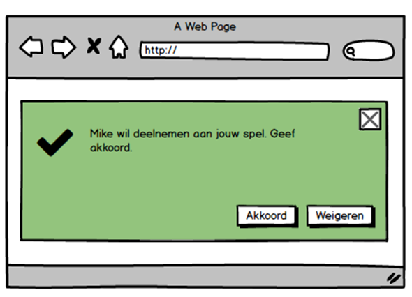

**Taakgroep: Styling**

# Context

Je hebt al enige ervaring met html en css. Je gaat deze kennis uitbreiden met dynamische CSS, responsiviteit en verder kennis opdoen op het gebied van semantische HTML.

# Taak: Semantische HTML

In deze opdracht breid je de feedback widget uit door deze te voorzien van semantische tags.

## Aanpak

-   Open het Webstorm project waarin zich de eerder gemaakte feedback widget zich bevindt.
-   Orienteer je op de verschillende [semantische HTML tags](#semantische-tags).
-   Vervang de HTML elementen van je feedback widget voor semantische tags.
-   Breid de HTML van je feedback widget uit met passende semantische tags aan de hand van onderstaande afbeelding. Later in dit level geef je de verschillende elmenten styling.

## Ondersteunende informatie

#### Semantische tags

HTML heeft in de eerste plaats een inhoudelijke betekenis. Dit is een belangrijk uitgangspunt. De verschijningsvorm is daar geen onderdeel van. De inhoud en de verschijningsvorm moeten dan ook zoveel mogelijk gescheiden worden. Temeer omdat d​e beteke​nis van DOM-elementen niet alleen bedoeld is voor de eindgebruiker maar ook zoekmachines interpreteren pagina's. Om dit zo betekenisvol mogelijk te doen kunnen semantische tags worden gebruikt, zoals bijvoorbeeld `<article>`. Elke tag geeft aan welk soort inhoud er verwacht kan worden in het DOM-element. Inmiddels zijn er een groot aantal [semantische tags](https://www.w3schools.com/html/html5_semantic_elements.asp). Een overzicht voor het maken van een keuze voor een semantische tag vind je [hier](https://internetingishard.com/html-and-css/semantic-html/).
