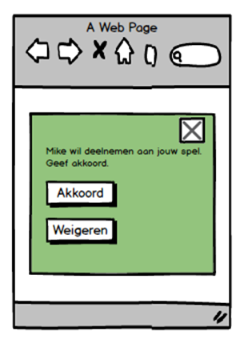

**Taakgroep: Styling**

# Taak: Responsive Webdesign

Wanneer een pagina veel gebruikt wordt op mobiele devices is het belangrijk dat de pagina  
wordt aangepast zodat deze gebruikersvriendelijk blijft, dit heet responsive webdesign,  
afgekort tot responsive. Hieronder staat een afbeelding van de feedback widget die op een mobiel device wordt getoond.

In deze opdracht maak je de feedback widget stapsgewijs responsive.

## Aanpak

-   Open het Webstorm project waarin zich de eerder gemaakte feedback widget zich bevindt.
-   Open de pagina met de feedback widget in de browser.
-   Open de developer tools en klik op de knop 'Toggle device toolbar', of CTRL + SHIFT + M.
-   Wanneer de feedback widget getoond wordt op een mobiel device dan moet het [icoontje verborgen](#elementen-verbergen-in-een-responsive-layout) worden. De schermgrootte waarop dit gedrag optreedt mag je zelf bepalen (maar niet desktop grootte ;-)).
-   Nu je weet hoe elementen verborgen kunnen worden bij mobiel gebruik kun je ook andere eigenschappen aanpassen.  
    Zorg ervoor dat de knoppen onder elkaar worden getoond.
-   Pas de grootte van de tekst aan bij mobiel gebruik naar 8px.

## Ondersteunende informatie

#### Elementen verbergen in een responsive layout

Afbeeldingen, icoontjes, bepaalde onderdelen van een webpagina. Het kan verstandig zijn om ze te verbergen bij mobiel gebruik om het overzicht te behouden.  
Voor het verbergen van elementen gebruik je media [queries](https://www.geeksforgeeks.org/how-to-hide-elements-in-responsive-layout-using-css/).
