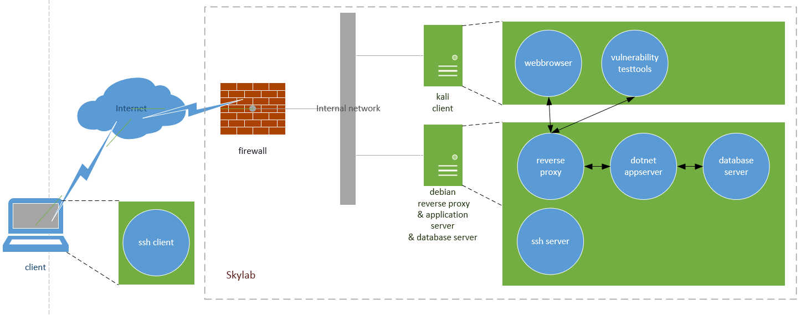

\*\* Task group: Infrastructure \*\*

# Context

The acceptance environment consists of

-   a client host, with a browser, running the client application and security test software (Kali distribution)
-   a server host, running Debian Linux with:
    -   a reverse proxy, terminating the HTTPS connection
    -   a dotnet application server, running the server application
    -   a database server running the database
    -   a firewall restricting access only via HTTP(S) (port tcp/80 and tcp/443) and SSH (port tcp/22)

Windesheim-ICT provides a Platform as a Service (PaaS) environment, called Skylab, for students developing IT infrastructures and applications. You can create your environment via [https://skylab.windesheim.nl](https://skylab.windesheim.nl) using your Windesheim account. You need an approval for creating the acceptance environment from [skylabbeheer@windesheim.nl](mailto:skylabbeheer@windesheim.nl). This may take a short while.



# Deliverables:

-   Show a working acceptance environment on Skylab.

# Task

Setup the acceptance environment on Skylab

## Subtask 1

On order to access the (graphical) consoles of your hosts in Skylab you need the VMware remote console tool. Install VMware remote console for connecting to your hosts in Skylab

1.  Install from [https://docs.vmware.com/en/VMware-Remote-Console/index.html](https://docs.vmware.com/en/VMware-Remote-Console/index.html)

## Subtask 2

Instantiate your SE Lab and pfSense, Kali and Debian hosts

1.  Login with your Windesheim account (just your s-number without @windesheim.nl) into [https://skylab.windesheim.nl/](https://skylab.windesheim.nl/)
2.  _Create SE lab_ from the catalog tab (Submit!)
    -   Enter your student number at _Group Members (voeg jezelf toe!)_
3.  (wait for Status Successful in the Request tab (may take a while))
4.  Instantiate a pfSense, Kali and Debian host from the catalog (_Submit!_)

You get a public IP address, like `145.44.234.X` for accessing the acceptance environment from the Internet. This means your hosts are facing the Internet and can (and will) be hacked, before you know it. All credentials needed to access the instantiated hosts can be found via the "?" button -> "Contact Support". **Change all passwords for these account, otherwise you'll be pwned in a minute.**

## Subtask 3: Configure the pfSense firewall on Skylab (part 1)

Your environment is protected by a firewall.

1.  See manual on Skylab (push “?” button -> "Contact Support")
2.  Click the instantiated pfSense firewall object (Deployments tab)
3.  Setup precisely two network interface cards: the external (transit network) and internal (studentnet0) networks to the firewall via _reconfigure_.
4.  Choose _Power on_ (wait…) and connect using VMRC to the pfSense firewall
5.  Look at the network interfaces in your Skylab environment and write down the MAC address of the transit- and the studentnet0-interface cards
6.  On your pfSense terminal: check, by looking at the MAC addresses, which network interface is your transit interface and which is your student0 interface, e.g. vmx0: transit, em0: studentnet0
7.  If not assigned: choose 1) Assign Interfaces: _no VLANs_, assign the transit interface to the WAN (Wide Area Network) and the studentnet0 interface to the LAN (Local Area Network)
8.  You should now be able to ping hosts on the Internet (if not: ask for help)
    1.  Choose _8 Shell)_: on the command prompt enter `ping google.nl`
    2.  Exit the shell by entering the command `exit` or `^D` (CTRL D)
9.  Choose _13) Upgrade_ (take a coffee)
10.  Choose _5) Reboot_
11.  The pfSense firewall will further be managed via a web browser on the kali host (part 2).

## Subtask 4: Configure Kali Virtual Machine

1.  Setup precisely one interface card for the Kali host, which is connected to the internal network (_studentnet0_), via _Reconfigure_.
2.  Power on the Kali host
3.  Connect via VMRC
4.  Login with `root/Welkom01!`

## Subtask 5: Configure Kali host

1.  Open a terminal
2.  You should be able to connect to the Internet (if not: ask for help)

    ```
     # ping google.nl
    ```

3.  Change the root password

    ```
     # passwd
    ```

4.  Finish pfSense configuration (part 2)
    1.  First open a webbrowser to `http://192.168.1.1`
    2.  Login with `admin/pfsense`
    3.  Change the password of admin (see the warning)
5.  Add yourself as a user and add yourself to sudo group

    ```
     # adduser USER
     # adduser USER sudo
    ```

6.  Update the system (may take a while). Possible _file system full_ errors can be solved via `# apt autoremove` and `# apt autoclean`

    ```
     # apt update
     # apt upgrade
     # apt dist-upgrade
     # apt autoremove
    ```

7.  Reboot the system

    ```
     # reboot
    ```

8.  After reboot login again with your account

## Subtask 6

Configure the Debian application virtual machine

1.  Setup the hardware via _Reconfigure_
    -   Setup one interface card and connect it to the internal network (studentnet0).
    -   Change the memory (RAM) to 3GB
2.  Power on and connect via VMRC
3.  Login with `root/Welkom01!`

## Subtask 7

Configure the Debian application server

1.  Start a command terminal and change the password of root

    ```
     # passwd
    ```

2.  You should be able to connect to the Internet (if not: ask for help)

    ```
     # ping google.nl
    ```

3.  Upgrade the OS software

    ```
     # apt update
     # apt upgrade
     # apt dist-upgrade
    ```

4.  Install additional packages/tools

    ```
     # apt install sudo net-tools gpg docker
    ```

5.  Install docker following the instructions at [https://docs.docker.com/install/linux/docker-ce/debian/](https://docs.docker.com/install/linux/docker-ce/debian/)
6.  Add your own account and add yourself to sudo group

    ```
     # adduser <username>
     # adduser <username> sudo
    ```

7.  Reboot

    ```
     # reboot
    ```


## Done

In the next assignments we will be configuring the pfSense firewall, HTTP proxy, dotnet application server and MS-SQL database server (via docker) and using the Kali host to check functionality (functional acceptance) and do vulnerability testing (security acceptance).
