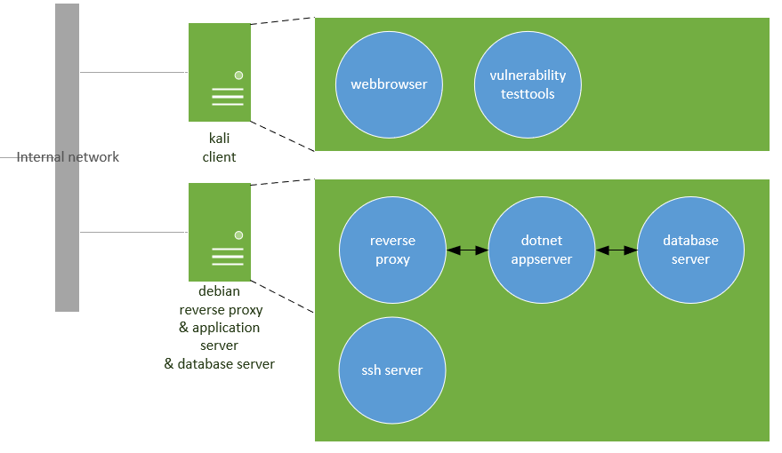

\*\* Task group: Infrastructure \*\*

# Context

A good security practice is to verify and validate your code before you put your software into production, the so-called development/deployment life cycle. We use a DTAP buildstreet model, consisting of the following phases:

-   a Development environment (your laptop): for development and unit testing
-   a Test environment (a Virtual Machine on your laptop): (automated) UI testing, security testing
-   an Acceptance (staging) environment (a PaaS on Skylab ([https://skylab.windesheim.nl](https://skylab.windesheim.nl))): performance testing, user acceptance testing, availability testing, security testing. The Acceptance environment closely resembles the Production environment.
-   and a Production environment (not used in this assignment).

Alternatives for the DTAP model are e.g. Continuous Integration/Continuous Delivery and DevOps: shorter cycles with the idea of 'eating your own dogfood', you do production operation on your own developed stuff.

During this course we will work on different platforms closely related to the platforms in an DTAP build street. You will be building software on a system for the Server and Client courses. The result is source code in a GIT repository, somewhere. The platform on which you write your code is usually referred to as the (D)evelopment environment.

After checking in your code, you will build and test your software on a (T)est platform. This platform should resemble your (A)cceptance and (P)roduction platform as close as possible to ensure that your software will work correctly in production. Our advice for this course is to use a Debian Test machine as this is the target platform in the Skylab you are supposed to use for acceptance.

The production environment consists of

-   a server host, running Debian Linux with:
    -   a reverse proxy, terminating the HTTPS connection
    -   a dotnet application server, running the server application
    -   a database server running the database
    -   a firewall restricting access only via HTTP(S) (port tcp/80 and tcp/443) and SSH (port tcp/22)

The acceptance environment contains, in addition to the server host,

-   a client host, with a browser, running the client application and security test software (Kali distribution)

The test environment looks like the Acceptance environment, except tools are available for debugging your code



# Deliverables

-   Show a working test virtual machine on your laptop
-   Show a working Kali VM on your laptop

# Task: Setup the test platform on your laptop

## Troubleshooting

If you run into a problem you can't resolve, you can download the complete SmokeTest VM from the ELO. Login with `dotnet/ict.se.scrt`.

## Subtask 1: setup VirtualBox with a virtual machine

If virtualization is new for you, you might want to read chapter 1 and the paragraph of chapter 2 that corresponds to your host OS in this fine manual: [https://www.virtualbox.org/wiki/Downloads#manual](https://www.virtualbox.org/wiki/Downloads#manual). As most of the security threats we will be discussing are network related, you might want to read chapter 6 also.

1.  Download and install VirtualBox from [https://www.virtualbox.org](https://www.virtualbox.org)
2.  Download a Debian small CD for network installation from [https://www.debian.org/distrib/netinst](https://www.debian.org/distrib/netinst). Choose the right processor architecture. This .iso file can be used as a bootable CD for the virtual machine we will be creating soon.
3.  Start VirtualBox
4.  Create a virtual machine in VirtualBox
    -   give it a pretty name
    -   Type: Linux
    -   Version: Debian (64 bit)
    -   RAM: 3GB (3072 MB)
    -   Create a virtual harddisk (VDI), dynamically allocated, 40GB
5.  Create a secondary network interface (Settings -> Network -> Adapter 2)
    -   Attached to: Host-only Adapter
    -   Name: VitualBox Host-Only Ethernet Adapter
6.  Put the downloaded Debian .iso file in the virtual CDROM drive
    -   Select the .iso file in Settings -> Storage -> Controller IDE -> Empty -> Optical Drive
7.  Start the VM and continue with Subtask 2

## Subtask 2: install Debian Linux OS

You don’t need a graphical interface to build, run and test a dotnet core web application. On a secure production or acceptance server, you don’t want one, because it would only introduce extra security risks (larger attack surface) and it would make your production server’s footprint much larger than necessary. On the other hand, you will be following many web tutorials to make your test environment work, and this calls for copying and pasting command lines from the tutorial to a terminal, A graphical user interface does make this task much easier.

See the 'Debian GNU/Linux Installation Guide for detailed information about the installation steps ([https://www.debian.org/releases/stable/amd64](https://www.debian.org/releases/stable/amd64)).

1.  Screen one: Select English as your language to optimize search results when searching fora or help documentation.
2.  Select Other, Europe, Netherlands, or any other location as you please.
3.  Select US from your local settings to get the most generic settings. Also, most of our keyboards use American English keymaps.
4.  The first network card is the one we will be using for internet access.
5.  You are free to think of a nice name for your virtual machine.
6.  Many people use a ‘.local’ domain name for test networks.
7.  Remember your root password. If you forget it, you might as well delete your machine.
8.  Create a normal user to access the graphical desktop.
9.  You should always use LVM for real servers, this makes scaling storage very easy and powerful. But as you are probably just using this machine for temporal work you might as well select ‘use entire disk’.
10.  On a real server you should split some directories on separate partitions to ensure the continuity of operation (Availability) despite a storage flood on a log partition or in some home directory. In this case we will be testing only, and all work will be temporal, so you can just select ‘All files in one partition’.
11.  We could discuss more about the risks involved in Swap storage (Confidentiality) but we won’t. If you are interested, you're welcome to join a security engineering project in your 3rd or 4th year.
12.  You don’t need to scan a second DVD or CD.
13.  ftp.nl.debian.org or ftp.nluug.nl are great mirrors for your package manager repositories.
14.  You don’t need a proxy.
15.  Continue the installation.
16.  You don’t need a print server but some extra graphical user interface could come in handy (LXDE is a light weight Desktop Environment).
17.  Make sure to select “SSH server” as this will be an important service to access your server remotely like you would do on a production server.

## Further tips

-   Use the snapshot feature of Virtualbox to save a working or initial state of your Debian machine. This way you can try several ways to accomplish a task without interfering with other tasks or labs. User manual: 1.11 Snapshots
-   Use the recording feature of Virtualbox to make a video file of your desktop. By reducing the number of frames and the resolution you can store more video time in a smaller file. User manual: 3.6.3 Recording Tab
-   To allow a normal user to use `sudo` (execute a command as another user) on Debian, `root` will have to add the user to the `sudoers` group. From a terminal run

    ```
      $ su -
    ```

    to become root. After that run

    ```
      # usermod -aG sudo <username>
    ```

    to add `<username>` to the `sudo` group. The change will be activated after you login again. All `sudo` actions will be logged in `/var/log/auth.log`.
-   To be able to use network tools like `ifconfig` on Debian you should install `net-tools`:

    ```
      $ sudo apt install net-tools
    ```

-   If you want to be able to alter your code from within your Debian test platform, the Visual Studio Code editor is available on Linux too. Use the instructions on the Visual Studio code website to download and install VS code.
-   In order to have multiple network interfaces up on your Debian test machine you need to exclude them from the network manager by allowing hotplug to activate your interface. Search for ‘Debian network configuration’ on Google to find relevant instructions to do this.
-   You might want to use `git` to clone a repository. Run

    ```
      $ sudo apt install git
    ```

    to install the `git` command line tool.
-   To run Debian full screen in a Virtualbox, one should install the VirtualBox Guest additions. You can insert a virtual Guest additions installation cd into your virtual machine by choosing ‘insert Guest Additions cd image’ from the ‘Devices’ menu.
-   After activating your ‘Host-only’ interface in Debian you can connect to your test server, from your host (laptop) using Putty (google 'Putty download') or activate the build in ‘OpenSSH Client’ in windows 10. Or simply use:

    ```
      $ ssh <username>@<test server IP>
    ```

    from any other operating system (macos, linux or solaris). If you're using VirtualBox your IP will probably be `192.168.56.101` (you can find your IP by entering `ifconfig` or `ip address`).
-   To keep your system up-to-date you may regularly run

    ```
      $ sudo apt update
      $ sudo apt upgrade
    ```

-   “Your tip here?”

# Done

The next task will be about setting up the Acceptance environment on Skylab.
