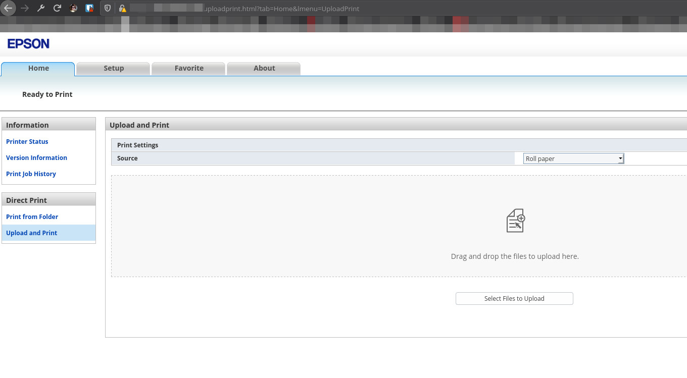
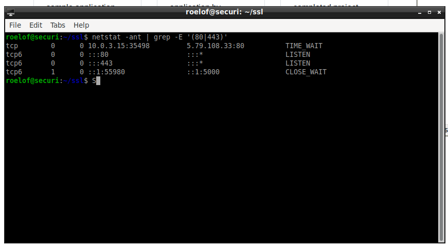
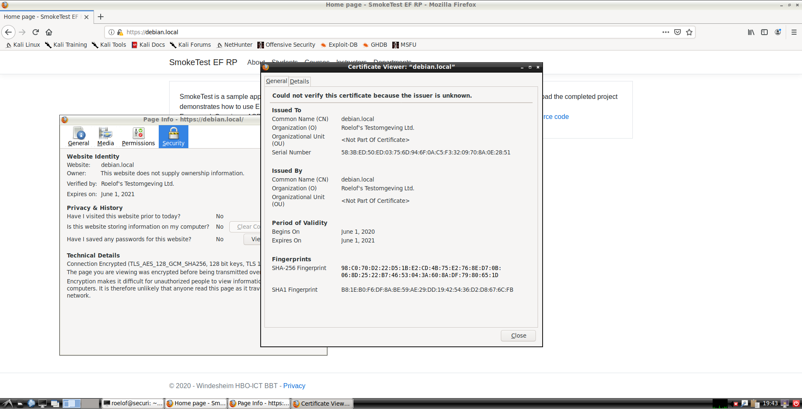
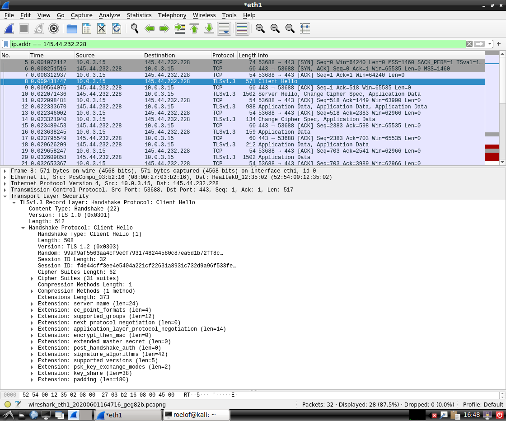
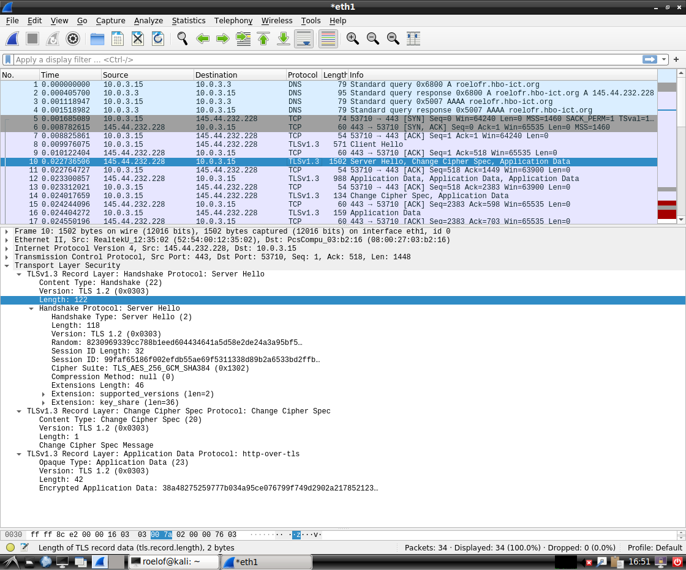
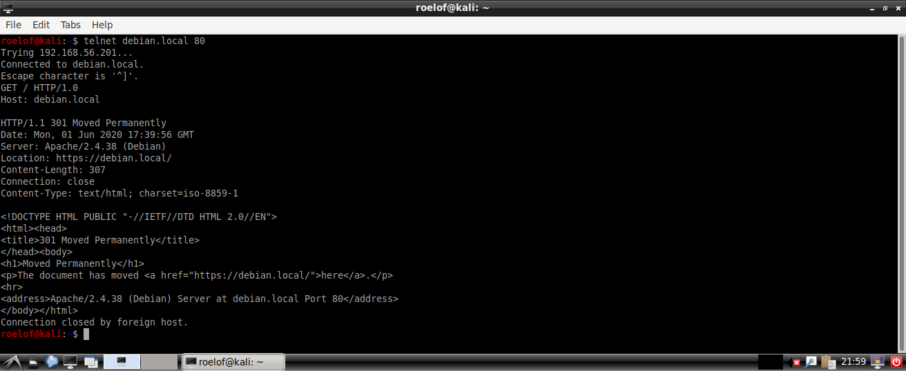
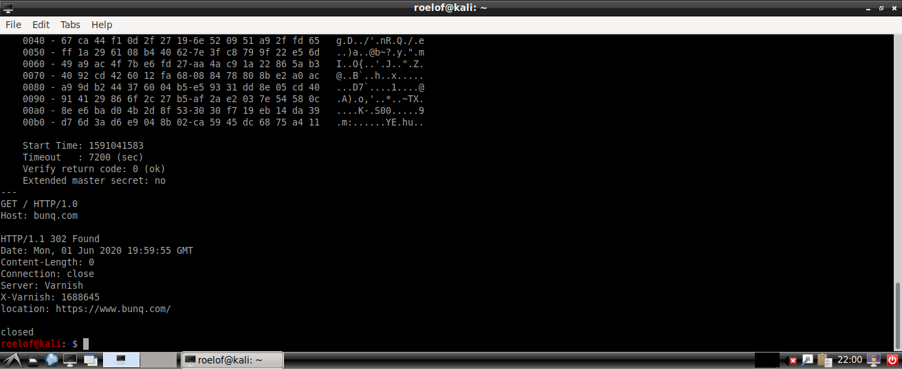
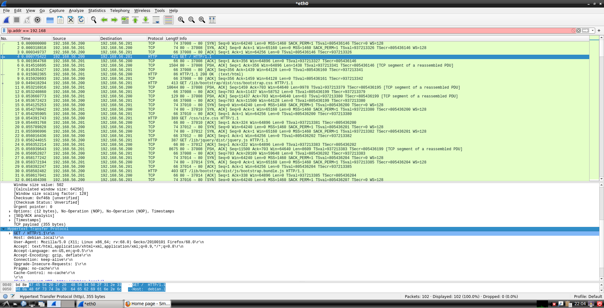
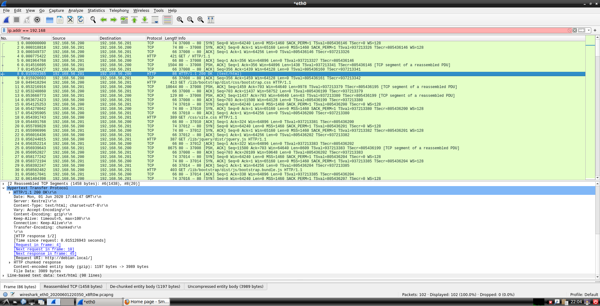
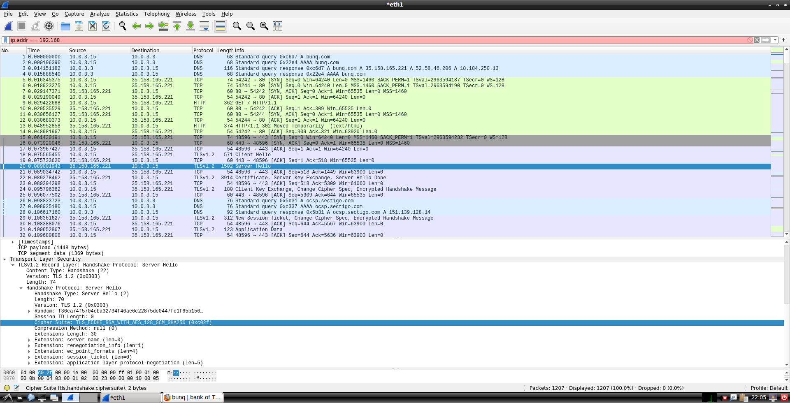

---
title: Security Portfolio
author: Roelof Roos
date: Feb 14, 2019
...

# Security Portfolio

## Google Dorks

Time to get your "hackerman" on by finding exposed documents on the World Wide Web, by using Google.

### Webcam

First off, let's get some webcams. They're notorious for exposing themselves on the internet, and it took me very little time to find one.
The first result I got was fairly juicy, as looking up the IP address pointed out that this webcam found, is actually located
on the San Diego State University campus, in San Diego, California, US.

Dork used: `inurl:/live.htm intext:"M-JPEG"|"System Log"|"Camera-1"|"View Control"`

Result: A webcam, shown below.


### Configurations

Another funny one to find is settings files. Firstly, I tried looking for `.env` files, but they're hard to come by. What, however, is more common is
a `settings.yml`, and looking for indexes containing that, resulted in a very juicy `configuration.yml` for `https://typology.online/`, which seems to
have a misconfigured webroot.

The credentials found granted access to the database (which is *not* protected by a firewall), but the request was rejected by hostname verification by
MariaDB.

Dork used: `intitle:"index of" "settings.yml"`

Result: A misconfigured webserver with production credentials for their MariaDB database.


### Printers

You can send your friends a Rickroll by just linking them an undercover video, but wouldn't it be more fun to Rickroll a random
exposed printer? Well, let's do just that.

Dork used: `intitle:"Printer Status" AND inurl:"/PrinterStatus.html"`

Result: an exposed printer, which even allowed me to print. It's again a university in the US (University of Arizona).



Don't worry, I printed them a message.


## Data leaks

### 1. JailCore

- Date of discovery: january 3, 2020
- Assets in danger:
  - Personal information of inmates in Florida (US), Kentucky (US), Missouri
    (US), Tennessee (US) and West Virginia (US), including:
    - prescription information,
    - medical information,
    - mugshots,
    - visit logs and,
    - activity logs
- Which security aspect was the attack about:
  - Unprotected material on a server
- How was the attack performed:
  - An Amazon S3 bucket was not properly protected (put in private mode or
    with ACLs)
- What was the result:
  - 36,077 files were leaked, with "significant" amounts of personal
    identifyable information about inmates, enough to fake their identity.

Sources:

1. https://www.tweaktown.com/news/70552/data-leak-reveals-inmate-incarceration-records-identity-theft-likely/index.html
2. https://www.vpnmentor.com/blog/report-jailcore-leak/


### Elector promotional website

- Date of discovery: 10 february 2020
- Assets in danger:
  - Full names, addresses and ID card numbers of voters in Israel
- Which security aspect was the attack about:
  - Leaked credentials
- How was the attack performed:
  - The source code of the site promoting the mobile app Elector contained the usernames and passwords of admin accounts for the app.
- What was the result:
  - A lot of data was 'publicly' available

Sources:

1. https://www.fastcompany.com/90462342/every-voter-in-israel-just-had-their-data-leaked-in-grave-security-breach?partner=rss


## Testing environment

### Getting a database

For the testing environment I needed a locally hosted MSSQL server. To save on installing extra
software (since Docker is installed anyway) and to ease configuration, I wrote the script below:

```bash
#!/usr/bin/env bash
set -e

# Check if container is running
if [ "$( docker ps --filter="name=roelof-mssql" | wc -l )" -eq 2 ]; then
	echo "MSSQL already running"
	exit 0
fi

docker run \
	--env 'ACCEPT_EULA=Y' \
	--env 'SA_PASSWORD=<password>' \
	--name 'roelof-mssql' \
	--publish 127.0.0.1:1433:1433 \
	--volume mssql-data:/var/opt/mssql \
	--detach \
	--rm \
	mcr.microsoft.com/mssql/server:2019-latest
```

Writing this to `start-mssql` and chmodding it with `chmod ug+x start-mssql` I can
allow our user to run it on demand, or just queue it on boot using a `@reboot $HOME/bin/start-mssql` line in the user's cron (`crontab -e`).

### Installing and starting the smoketest

After doing this, I downloaded the Smoketest via Git using `git clone <url> ~/apps/smoketest`.
Afterwards I updated `SmokeTest/appsettings.json` to match the password set in the `<password>` line above and I made the following script to ensure the URLs are consistent (a problem I ran in on my acceptance server, but not on testing but since they should be similar, this'll do).

```bash
#!/usr/bin/env bash
set -e

cd $HOME/apps/smoketest

dotnet run --project SmokeTest --urls=http://localhost:5000
```

Simply store it as `$HOME/bin/start-smoketest`,  `chmod +x` it to make it executable and then run `~/bin/start-smoketest` starts the smoketest.

### Getting Apache2 to show the smoketest

Now to confgure Apache2 to work. We need to show our application on our test server, which is available at `192.168.56.201`. The easiest
way to do this, is to add `192.168.56.201 debian.local` to our `/etc/hosts` file, and then use `debian.local` as hostname.

Now, to configure Apache to work on that domain. I created a new `security.conf` file in `/etc/apache2/sites-available`, and added the following contents:

```apache2
<VirtualHost *:80>
   ServerName debian.local

   # Log
   ErrorLog ${APACHE_LOG_DIR}/error.log
   CustomLog ${APACHE_LOG_DIR}/access.log combined

   # Proxy
   ProxyPass / http://localhost:5000/
   ProxyPassReverse / http://localhost:5000/
   ProxyPreserveHost on
</VirtualHost>
```

Now activate it:

```
sudo a2enmod proxy_http
sudo a2ensite security
sudo systemctl restart apache2
```

The result? A working smoketest on testing!


### Securing the connection

For our HTTPS-connection on the server, I created a self-signed certificate and copied it to `/etc/apache2/ssl`

```bash
# Make key in local home dir
mkdir ~/ssl
cd ~/ssl

# Create self-signed key
openssl req -x509 -newkey rsa:4096 -nodes -keyout key.pem -out cert.pem -days 365

# Create dir in Apache2
sudo mkdir /etc/apache2/ssl

# Copy key
sudo cp key.pem cert.pem /etc/apache2/ssl

# Ensure it's only readable by root
chown root:root /etc/apache2/ssl
chmod 0600 /etc/apache2/ssl/*.pem
chmod 0700 /etc/apache2/ssl
```

Finally, I changed the `security.conf` to listen on port `443` and to redirect traffic on port `80`.

```apache2
<VirtualHost *:443>
   ServerName debian.local

   # Enable SSL
   SSLEngine on
   SSLCertificateFile /etc/apache2/ssl/cert.pem
   SSLCertificateKeyFile /etc/apache2/ssl/key.pem

   # Proxy
   ProxyPass / http://localhost:5000/
   ProxyPassReverse / http://localhost:5000/
   ProxyPreserveHost on
</VirtualHost>

# Redirect to HTTPS
<VirtualHost *:80>
   ServerName debian.local
   RedirectPermanent / https://debian.local/
</VirtualHost>
```

Then, just restart apache after enabling ssl:

```bash
sudo a2enmod ssl
sudo systemctl restart apache2
```

And as a final check, let's make sure Apache is actually listening on port 80 and 443.



So, having checked that, time to connect:



### Monioring the handshakes

I've also used wireshark to monitor the TLS handshake, both the client and server conversations are shown:




We can see that the certificate is self-signed (and it's initially rejected by Firefox), so might as well look into
the connection using Wireshark. THe handshake below indicates a properly modern AES 256 encryption with a SHA384 hash.
According to Mozilla that's proper modern standards, so we can safely assume our user's data is protected, although
the browser does warn about an unknown certificate (luckily, Let's Encrypt is a thing, so that's just a few clicks away).

Too bad that the server doesn't seem to support TLS 1.3, since it's actively downgrading to TLS 1.2, even though cURL asks for
the newer version.

### Promoting to acceptance

Using `dotnet publish` we can create a publishable, single-file executable of our app. This allows us to transfer the already-built app from our
testing environment to our acceptance env.

The requirement is to be framework-dependent, so we can simply create a single-file executable which isn't self-contained to
ensure the user has the Dotnet Core runtime installed.

The command used are `dotnet publish` and `scp` to transfer the file from the Testing to the Acceptance env. I pre-configured my SSH
connection using `~/.ssh/config` to allow me to simply use `acceptance` as hostname.

```bash
dotnet publish \
    --runtime linux-x64 \
    --output $HOME/apps/smoktest/publish \
    --self-contained false \
    -p:PublishSingleFile=true \
    $HOME/apps/smoketest/SmokeTest

scp -rp $HOME/apps/smoktest/publish/* acceptance:apps/smoketest
```

Now, on the acceptance, we can run `~/apps/smoketest/SmokeTest`, and it'll launch the app.

## Testing HTTP and HTTPS

Since HTTP is a simple ascii-based protocol, just like `telnet`, it's easy to write an HTTP request yourself.

For example, when checking what the local testing server uses, we can connect using our `debian.local` alias and send a simple request

```
telnet debian.local
> GET / HTTP/1.0
> Host: debian.local
```

We need to specify the host, as otherwise the default Apache page will be shown (as we've only bound to our
`debian.local` hostname).



We can do the same when connecting to HTTPS, but since encryption is NOT ascii (and rather hard to do by hand in the alloted time), we can use the `openssl` `s_client` to connect over TLS, and then write our request.

The request body remains the same.



#### Inspecting the packages

But running HTTP over telnet is all fun and games, but Telnet takes out the majority of the work, especially concering the packages.

We can use wireshark to inspect the contents of these connections, where we can see that our HTTP request easily fits in one frame.



The response though, being bigger, won't fit in one frame and Wireshark nicely tells us which frames contain the rest of the data (the screenshot below
only shows the headers).



With HTTPS, however, we cannot see the content of the packages (which is good, otherwise the security of HTTPS isn't actually secure). Instead, we can see some "Client Hello" and "Server Hello" messages, where the protocols and keys are negotiated (to eventually end up on ECDSA using AES 128 bits encryption and a SHA256 hash). After this negotiation we start seeing packages with "Application data", which is the encrypted payload of the HTTP request and response.



## Scanning our web app using the Zed Attack Proxy

TODO

## 4A: Architecture

For Reversi the assignment is to create a fully working application, but as I already completed my Server class, I did not do this.
However, for this application we still need a basic AAAA system, so I made that instead.

### Use cases

- A guest should be able to login
  - Evil: Attacker may try to brute-force accounts
  - Evil: Attacker may try to bypass login
- A guest should be able to reset it's password
  - Evil: An attacker may test if accounts exist by probing e-mails
- A guest should be able to register for a new account
  - Evil: An attacker may spam accounts
  - Evil: An attacker may try to use company e-mails to automatically obtain priviliges
- A guest should be able to prove it's identity after login using a 2nd factor
  - Evil: An attacker may try to bypass the 2nd factor
  - Evil: An attacker may try to brute-force 6-digit tokens
- A user should be able to alter it's password
  - Evil: An attacker may attempt to reset a user's password from a different site
- A user should be able to logout
  - Evil: An attacker may try to log out users
- A user should be able to go to an 'admin' screen

### Class diagram
